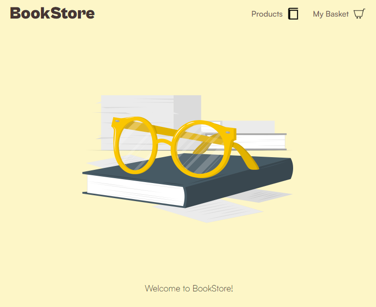

<h1 align="center">e-bookstore app</h1>

  

## <ins>Live Demo</ins>
[Go to demo](https://e-bookstore.vercel.app)

## <ins>Description</ins>
This is a responsive SPA created as a simple electronic bookstore with a product and a cart page.

## <ins>Built with</ins>
This project was built using the __React.js__ framework with __TypeScript__. The supporting tools/libraries that were used are:
- __axios__ for making api requests.
- __react-query__ for handling api requests.
- __react context__ for global management.
- __react router v6__ for routing.
- __cloneDeep__ and __isEqual__ methods from lodash for easier object handling in state changes.
- __classNames__ for easier dynamic class handling.
- __Sass__ preprocessor for styling.

## <ins>Design decisions</ins>

### Global State schema
For the needs of this app __react context__ was more than enough, so 2 main context providers were created:
- __ProductsContextProvider__ which contains:
  - `products` data.
  - `status` of api request in order to dynamically render different UI based on it.
  - `updateStock` function to use when products are added/removed from the basket. 
- __BasketContextProvider__ which contains:
  - a `data` object that contains: 
    - `data.items`, an array of product ids that are currently in the basket.
    - `data.count`, the total number of products in the basket (data.items.length is not good , because more than one product with the same id might be selected).
    - `data.checkout_price`, the current checkout_price including discount if it applies.
    - `data.hasDiscount`, which currently is assigned a boolean value once when the app loads based on the browser's local date.
    - `data.discount`, which currently assigned once the value 0.2, as requested in the specs.
  - `update` function, which is used to update the data when needed inside the respective components.

### Reusability
__Custom hooks__ were created, in order to share stateful logic between components. 
A good example of that is the `useUpdateBasket` hook, where all the logic regarding updating stock, selected products, total count of products in the basket etc. is taking place. This way there is only one place that a developer needs to make changes/additions, in case of changed specifications.

__Reusable components__ were created, in order to share UI and styling without code duplication. 
A good ecample of that is the `IllustrationSection` component, which a generic page with a dynamic message and is used in different scenarios such "no products curretly in the basket", "loading state of api request" etc.

### Caching
To __improve the display time__ when users are revisiting the app, the approach was to __cache the fetched product__ data in the browser's __local storage__ (you can find it under the id "cachedProducts"). 

The logic is that when a user revisits the app, the products global object is assigned the cachedProducts. When eventually the API returns the server products data, global products state object will only be updated if the cachedProducts are different compared to the server products (this is where isEqual from lodash was used to perform deep object comparison).

### Data normalization
By default the server products data is an array of product objects. However, for the products of the global state of the app this data gets transformed as follows:
`{"1" : {id: "1", title: "Book 1", price: 10, ...}, "2": {id: "2", title: "Book 2", price: 20, ...}}`.

This way it is easier and much faster to index the desired product when required, compared to searching the whole product array. It should be noted that with such a small array of server data the performance gain is minimal, but this approach was followed as a generally good practice. 

## <ins>Run, test, build and deploy the app</ins>
Clone the repository on your local machine, open a command line and navigate to the repo's top level folder. Make sure that you have npm installed.

#### `npm install`
Start by running this command to install all dependencies.

#### `npm start`
Runs the app in the development mode.\
Open [http://localhost:3000](http://localhost:3000) to view it in the browser.

#### `npm test`
Launches the test runner in the interactive watch mode.\
See the section about [running tests](https://facebook.github.io/create-react-app/docs/running-tests) for more information.

#### `npm run build`
Builds the app for production to the `build` folder.\
It correctly bundles React in production mode and optimizes the build for the best performance.

#### Deploy
Whenever new code is pushed to the master branch the app will be deployed in vercel.
